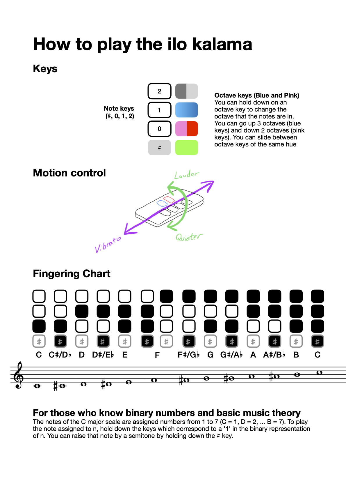

# ilo kalama

A musical instrument designed around being playable on a smartphone.

I was inspired to make a musical instrument after watching [Wintergatan's modulin video](https://www.youtube.com/watch?v=QaW5K85UDR0).
5 years after making an iOS app for my own personal use, I made a web version for anyone to try.

The timbre was chosen to resemble that of a theremin. 
The name comes from the [toki pona](https://www.tokipona.org) for 'musical instrument'.

---

## Playing the ilo kalama

[PDF version](how-to-play-ilo-kalama.pdf)

### Tips for playing the web version
* Enable rotation lock
* If you don't hear any sound, check whether the ringer is muted
* Hide the browser UI to avoid erroneous inputs

## Features yet to be implemented
* Portamento
* Adjusting key size
* Left-handed mode